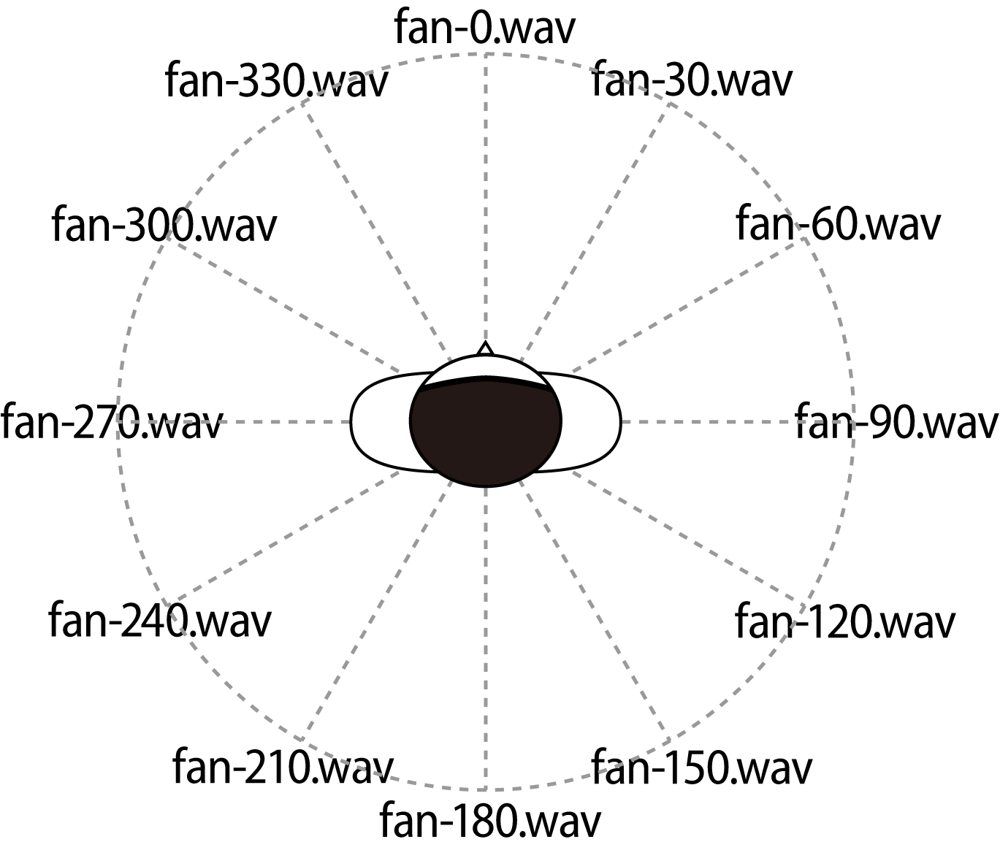

# AlteredWind_materials
Materials in "AlteredWind: Manipulating Perceived Direction of the Wind by Cross-modal presentation of Visual, Audio and Wind Stimuli"

## Content
### `audio` directory
It contains the audio files used in AlteredWind.

- `fan-*.wav`
    - Three-dimensional sounds of wind from every 30◦ rotation angle.
    - For the best result, we recommend you to use headphones to play them.
    - 
- `fan-mono.wav`
    - The sound of the wind that was converted to monaural sound for comparison.

## License
<a rel="license" href="https://creativecommons.org/licenses/by-sa/4.0/">
    
</a><br>

<a href="https://doi.org/10.1145/3355049.3360525" property="cc:attributionName" rel="cc:attributionURL">AlteredWind by Kenichi Ito, Yuki Ban, Shin'ichi Warisawa</a> is licensed under a <a rel="license" href="http://creativecommons.org/licenses/by-sa/4.0/"> Creative Commons Attribution-ShareAlike 4.0 International License</a>.<br>

## Citation
We would be pleased if you cite AlteredWind in your work.

ACM Ref:
>Kenichi Ito, Yuki Ban, and Shin'ichi Warisawa. 2019. AlteredWind: Manipulating Perceived Direction of the Wind by Cross-Modal presentation of Visual, Audio and Wind Stimuli. In SIGGRAPH Asia 2019 Emerging Technologies (SA '19). Association for Computing Machinery, New York, NY, USA, 3–4. https://doi.org/10.1145/3355049.3360525

BibTeX:
```tex
@InProceedings{Ito2019AlteredWind,
  author        = {Ito, Kenichi and Ban, Yuki and Warisawa, Shin'ichi},
  title         = {AlteredWind: Manipulating Perceived Direction of the Wind by Cross-Modal Presentation of Visual, Audio and Wind Stimuli},
  year          = {2019},
  isbn          = {9781450369428},
  publisher     = {Association for Computing Machinery},
  address       = {New York, NY, USA},
  url           = {https://doi.org/10.1145/3355049.3360525},
  doi           = {10.1145/3355049.3360525},
  booktitle     = {SIGGRAPH Asia 2019 Emerging Technologies},
  pages         = {3--4},
  numpages      = {2},
  keywords      = {haptics, Wind display, cross-modal, multimodal interaction},
  location      = {Brisbane, QLD, Australia},
  series        = {SA ’19}
}
```
